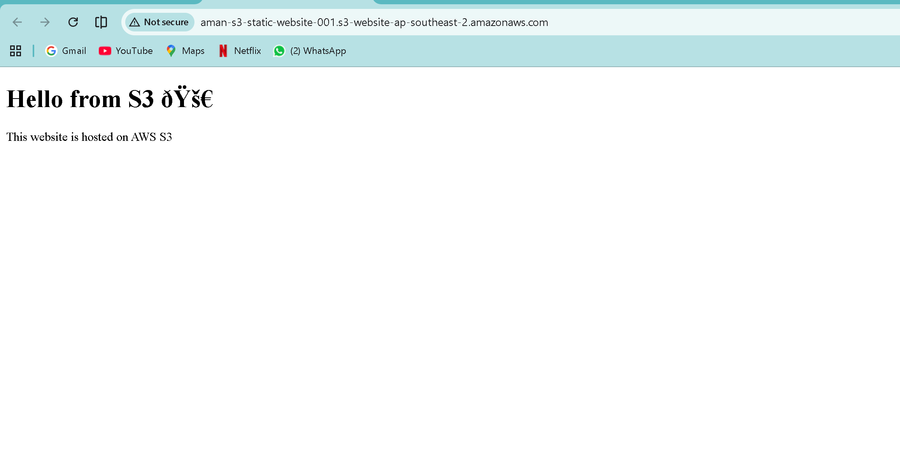
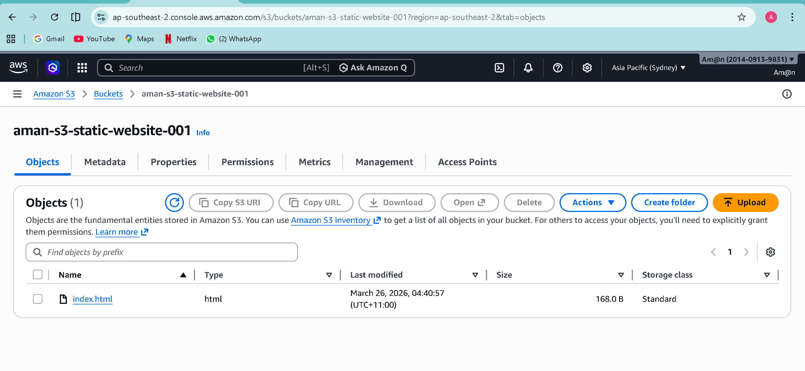
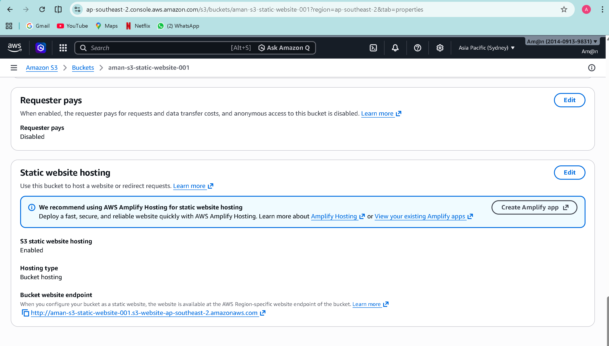

# AWS S3 Static Website Hosting

## Project Overview
This project demonstrates how to host a static website using Amazon S3. The website is publicly accessible via an S3 website endpoint.

## Technologies Used
- AWS S3
- HTML

## Implementation Steps
1. Created an S3 bucket
2. Disabled block public access
3. Uploaded index.html file
4. Enabled static website hosting
5. Added bucket policy for public access
6. Accessed the website using S3 endpoint

## Live Demo
The website is hosted using AWS S3 static hosting.

## Screenshots

### Website Output

### S3 Bucket

### File Upload

### Static Hosting Enabled

## Author
Aman Nasir
